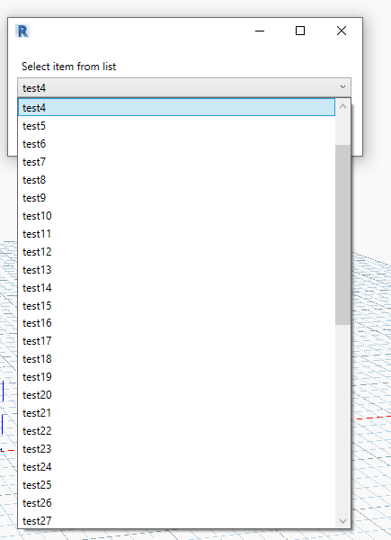

# DynaForms
DynaForms is a Dynamo for Revit package used to implement WPF forms for selection of items from a list of items at runtime of Dynamo script.

## Background

## Nodes
1. **FormComboBox** 

    

    

2. **FormListSelect**

    
    
    

3. **FormMultiSelect**

    
    
    
    
## How to use
1. Copy DynamoForms.dll from /Compiled folder to your local folder (e.g. C:\Users\<UserName>\Documents\Dynamo )

2. Open Dynamo, File -> Import Library...
    Select DynamoForms.dll from your local folder
    
## Contributions
Please feel free to test and contribute to this Dynamo node.
    
